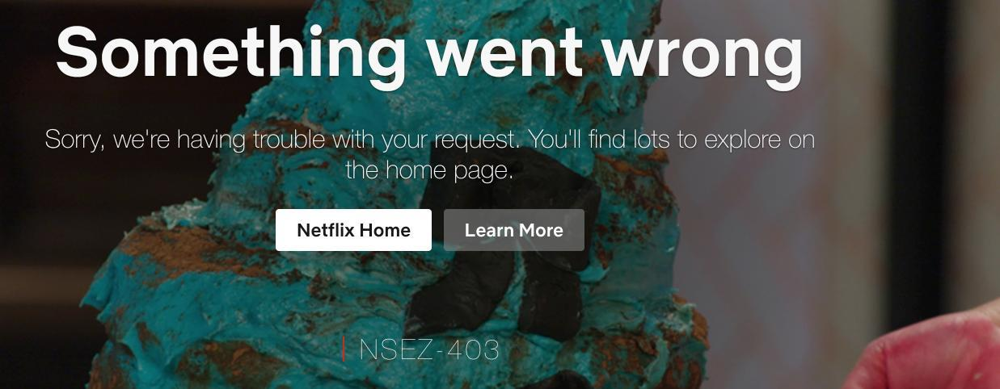

# Netflix 问题

## 1.Netflix 报错NSEZ-403 Something went wrong

Netflix 登录如有此报错请用其他非 IPLC 节点登录 Netflix 账号后,再切换 IPLC 节点即可.

## 2.Netflix 电视机、安卓盒子 提示代理报错

因电视机或安卓盒子一般通过路由器进行代理，所以需要原生解锁支持，节点标注 nfo 的则表示为 Netflix 原生解锁，请使用原生解锁节点。

