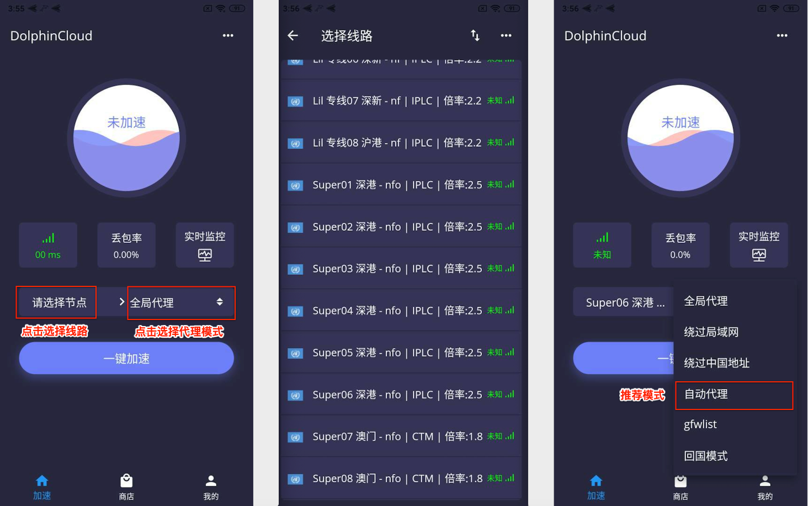
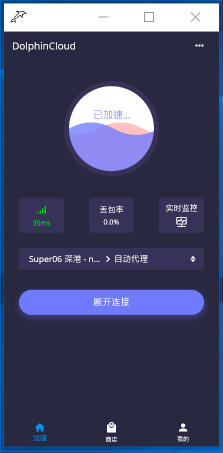

# App for macOS

## 下载安装及使用教程

完成以下简单配置步骤，即可享用海豚湾云服务。\(阁下可能需要花3~5分钟左右的时间完成教程\)

## 1.请点击下方的下载地址开始下载并安装

[下载地址 1](https://oss-hitun.sgp1.cdn.digitaloceanspaces.com/app/DolphinCloud.exe)    [下载地址 2](http://app.hitun.me/DolphinCloud.exe)

## 2.打开安装的 DolphinCloud 应用程序并登陆


因客户端图标为纯黑色透明，如您任务栏也是纯黑色或深色，则会很难看到任务栏的海豚图标


## **3.客户端的使用及配置**

## **4.连接使用**

* 点击一键加速
* 显示已加速，则表示成功连接。
* 实时监控为监测连接线路的延迟。

> #### 现在您可以享受 海豚湾云服务 接入点带来的全新国际网络访问体验。

