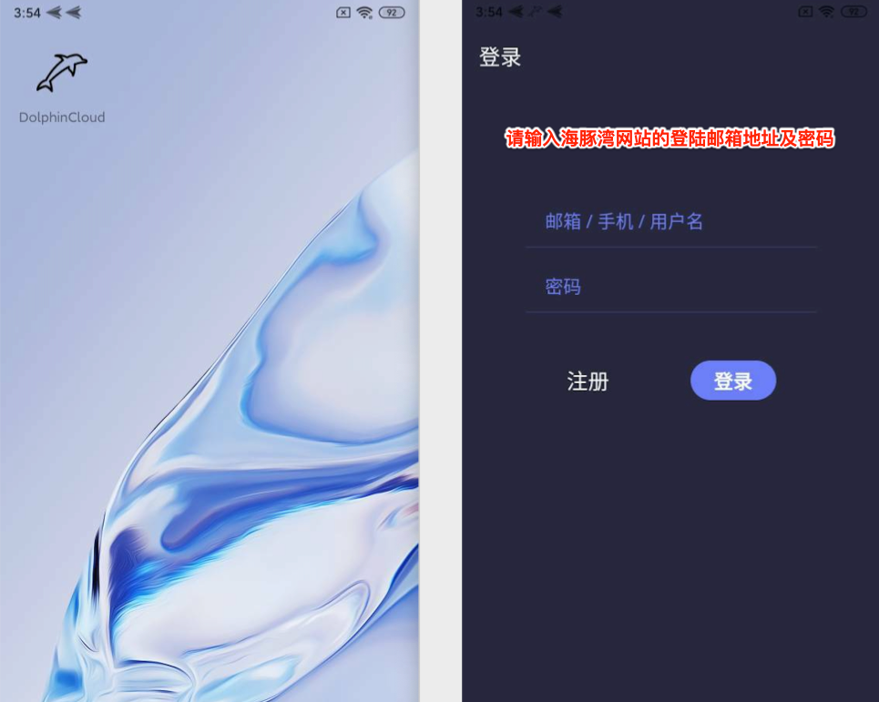
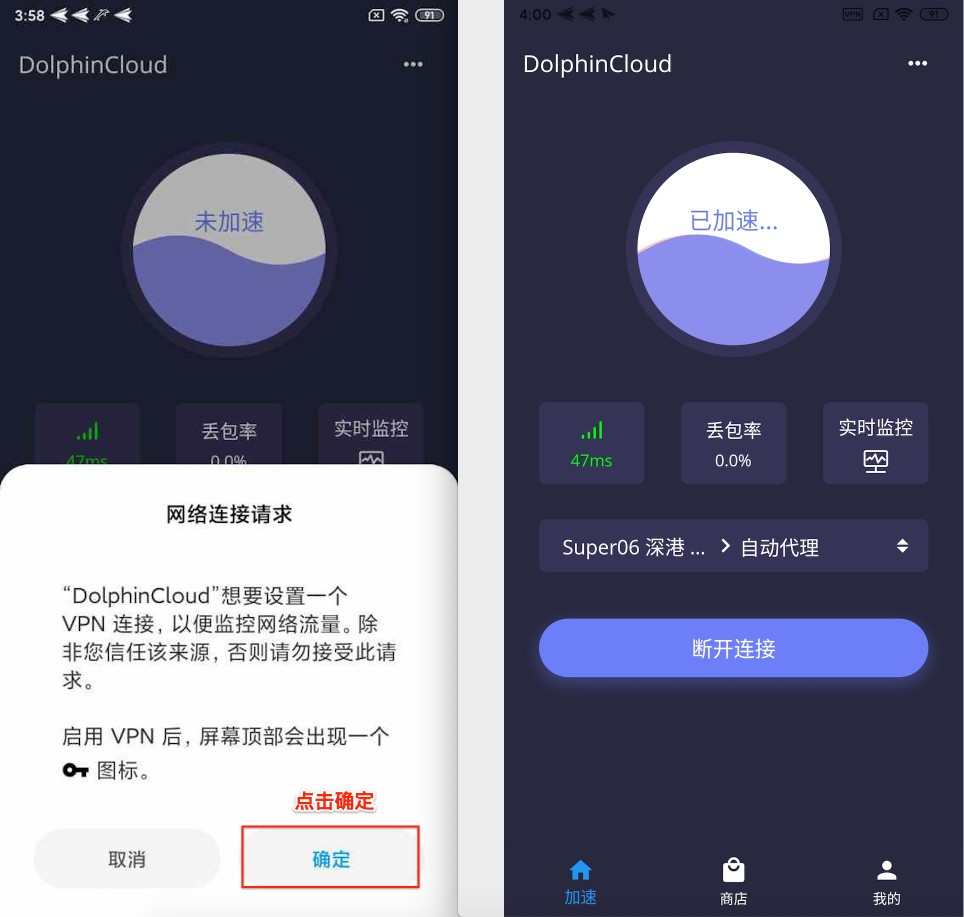

# App for Android

## 下载安装及使用教程

完成以下简单配置步骤，即可享用海豚湾云服务。\(阁下可能需要花3~5分钟左右的时间完成教程\)

### 1.请点击下方的下载地址开始下载并安装

[下载地址 1](https://oss-hitun.sgp1.cdn.digitaloceanspaces.com/app/DolphinCloud.apk)    [下载地址 2](http://app.hitun.me/DolphinCloud.apk)

### 2.打开安装的 DolphinCloud 应用程序并登陆

### **3.客户端的使用及配置**

### **4.连接使用**

* 如果是首次连接，则系统会弹出如上的提示框，请点击**「确定」**
* 显示已加速，则表示成功连接。
* 实时监控为监测连接线路的延迟。

> #### 现在您可以享受 海豚湾云服务 接入点带来的全新国际网络访问体验。

