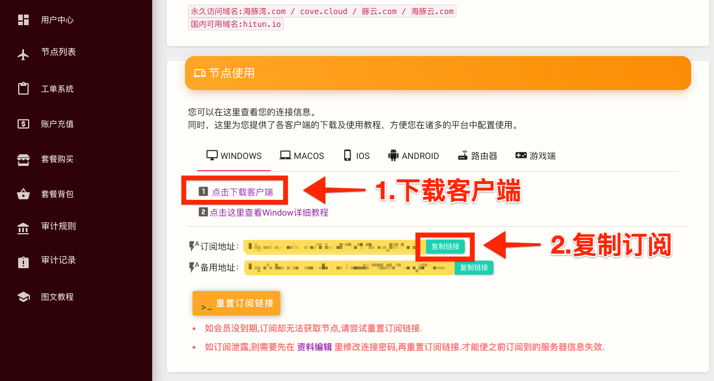
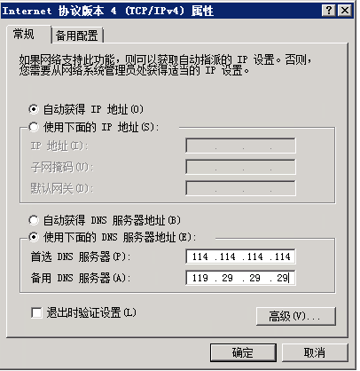

# ShadowsocksR

| 系统要求： | Windows XP 及以上 |
| :--- | :--- |
| 软件版本： | ShadowsocksR 最新版 |
| 设备要求： | Windows PC / Tablet |

### 配置及使用教程

完成以下简单配置步骤，即可享用海豚湾云服务。\(阁下可能需要花5~10分钟左右的时间完成教程\)

> #### 1.请使用浏览器打开 海豚湾 用户中心 - 查看快速添加节点

* 点击下载 Windows 客户端文件并安装。
* 复制订阅地址，配置客户端时需使用。


订阅地址包含您的订阅信息，阁下应当把它当做密码一样妥善保管，请勿泄露给他人！


> #### 2.打开 ShadowsocksR 客户端

* 根据系统.NET版本选择客户端。

* 右键点击托盘栏的纸飞机图标
* 关闭**「负载均衡」**
* 打开**「SSR服务器订阅设置」**

> #### 3.配置订阅地址

* 点击「**Add**」按钮
* 右侧「**网址**」的「**输入框**」中粘贴刚才在官网复制的「**订阅地址**」
* 勾选「**自动更新**」并

> #### 4.更新订阅

* 再次右键点击托盘栏纸飞机图标，在「**服务器**」选项卡中选择  **更新 SSR 服务器订阅（不通过代理）**

\*\*\*\*


一小段时间后（具体时间取决于您的网络环境），您将会收到 **服务器订阅更新成功** 的通知消息，同时查看服务器列表也可以看到对应的 海豚湾 接入点。


* 提示「**更新成功**」
* 右键点击托盘栏的纸飞机图标 「**服务器**」**-** 「**海豚湾**」中选择节点使用


如果订阅失败，可尝试将本地DNS地址改为114.114.114.114 和 119.29.29.29 并重试更新。



使用 海豚湾 订阅节点是目前最推荐的做法，使用后您无需每次在 海豚湾 更新接入点后手动前往 海豚湾 用户中心更新配置，而是可以令客户端在每次启动是自动尝试更新配置文件，同时您也可以手动来立即更新接入点信息。


> #### 5.配置规则

* 右键点击托盘栏纸飞机图标，在「**代理规则** 」菜单中选择**「绕过局域网和大陆」**。

* 再次右键点击托盘栏纸飞机图标，在**「系统代理模式」**菜单中选择**「全局」**。

> #### 现在您可以享受 海豚湾云服务 接入点带来的全新国际网络访问体验。

